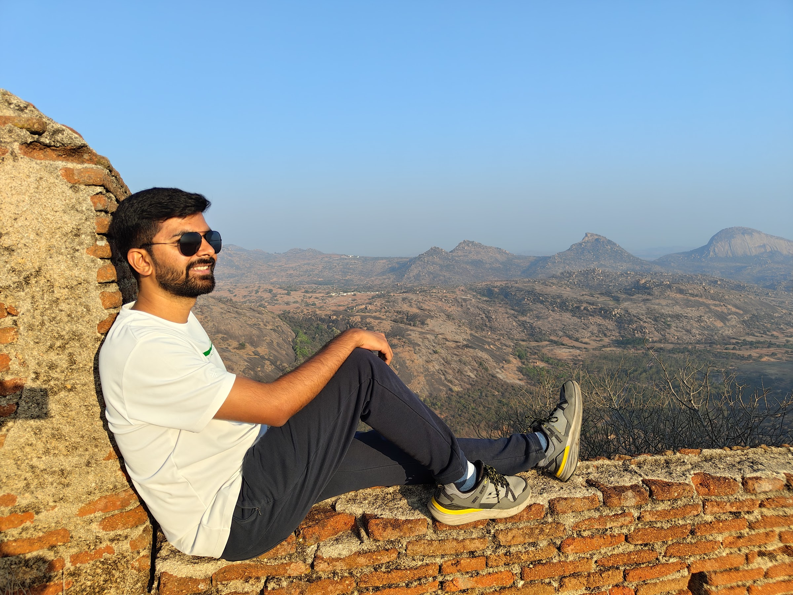
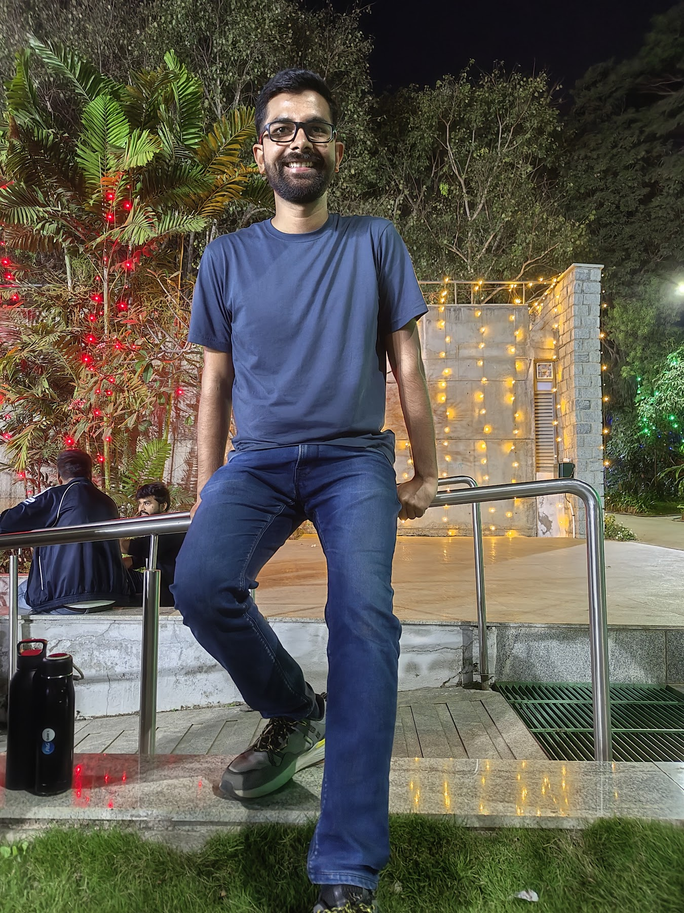
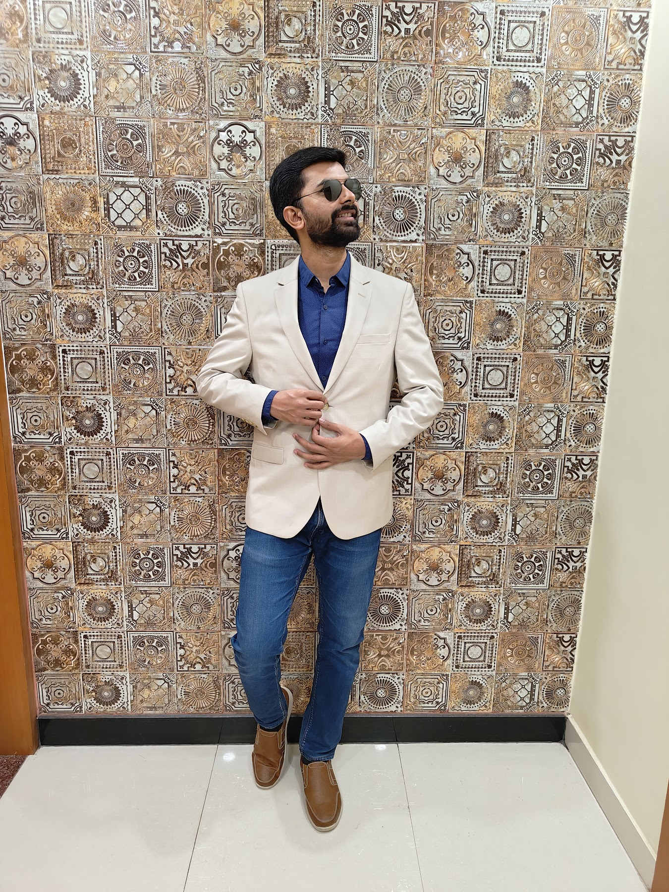
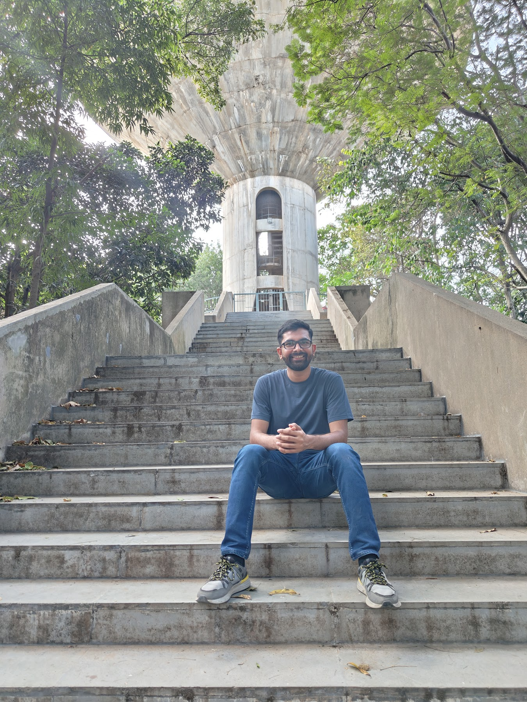

---
# https://vitepress.dev/reference/default-theme-home-page
layout: home

hero:
  name: "Meliorism"
  text: World through my lens
  tagline: Kumar Gaurav
  actions:
    - theme: brand
      text: Learn more about me
      link: /about-kumar-gaurav
    - theme: none
      text: Some recent contents
      link: /recent-contents
    - theme: none
      text: Trips & Travel Stories
      link: /trips-and-travel/

features:
  - title: Entrepreneur
    details: Build Twople, Qruze among other ventures. Most of my time goes in this domain.
  - title: Software Engineer
    details: With over 5+ years of experience developing and deploying full-stack web/mobile apps at varying scale.
  - title: Design Enthusiast
    details: Always curious to learn about good designs. 
---

<h3 style="text-align: center; margin: 200px auto 50px;">Some photos to satisfy the algorithms...</h3>

  

  
  
  

